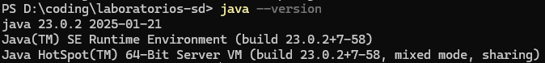
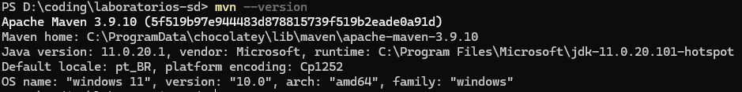
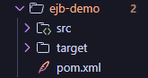
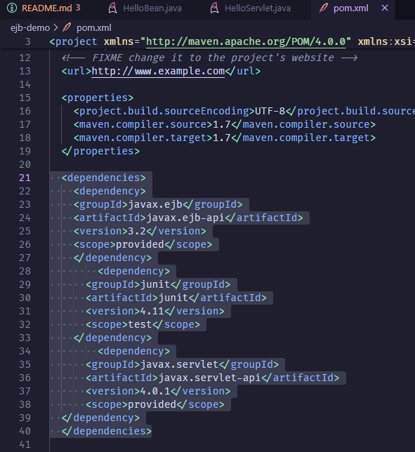
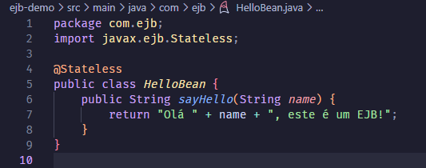
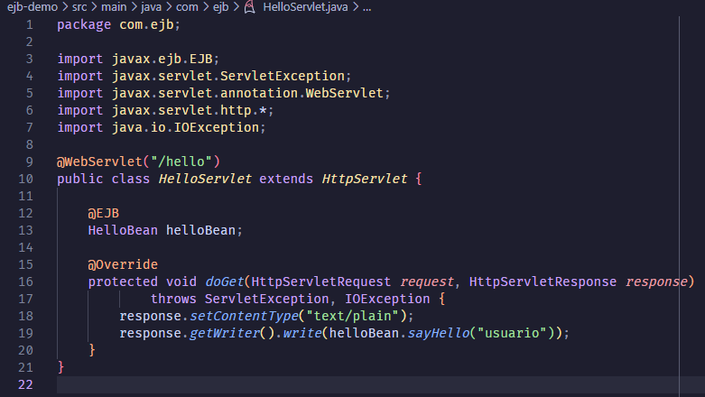
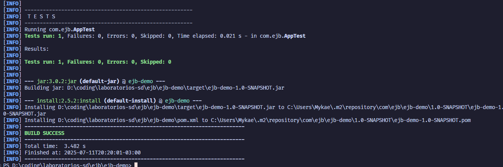
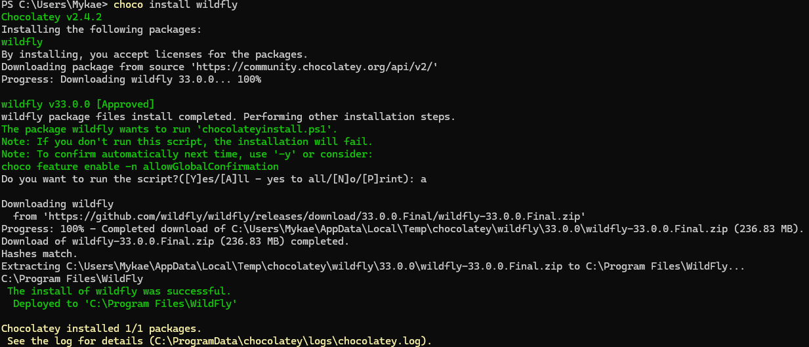
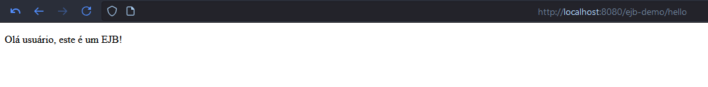

## 1. Instalar o Java

## 2. Instalar o Maven

## 3. Criando o Projeto EJB no VSCode

## 4. Configurar o pom.xml

## 5. Criar os Beans

## 6. Criar o Servlet

## 7. Empacotando e Executando

## 8. Testando o EJB

