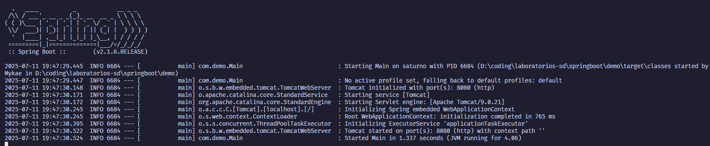

## 1. Instalar o Java

## 2. Instalar o Maven

## 3. Criando o projeto

## 4. Configure o pom.xml

## 5. Criando o código

## 6. Executando o código

#### Executando o Spring Boot

#### Acessando a rota /

#### Acessando a rota nome/\<meu-nome\>

#### Acessando uma rota inválida

