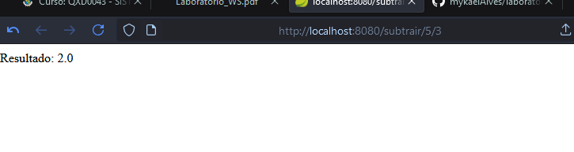

## 1. Instalar o Java

## 2. Instalar o Maven

## 3. Criando o Projeto

## 4. Configurar o pom.xml

## 5. Criação do Código WebService (API REST)

## 6. Executando o código

## 7. Resultados esperados

